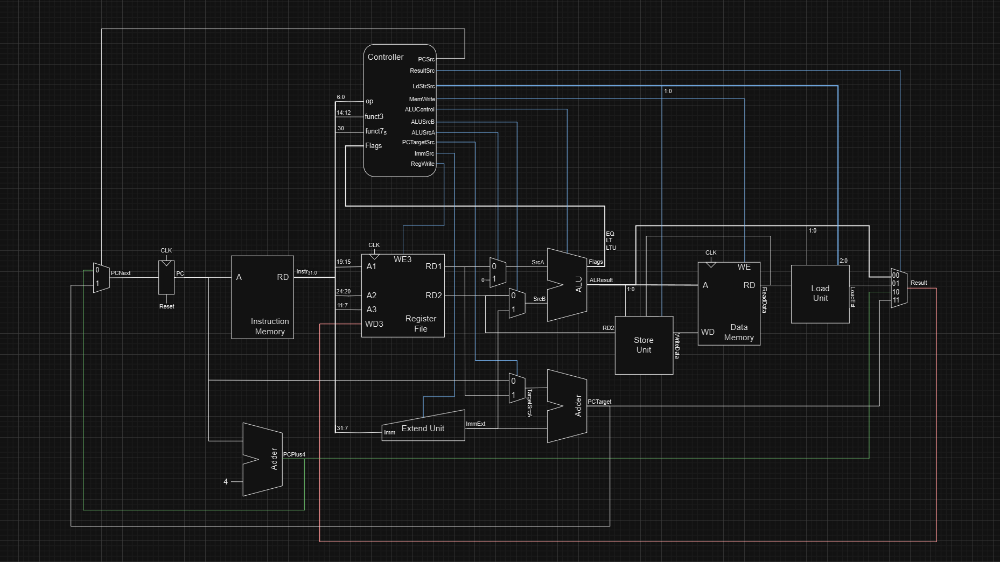

# Single-Cycle RISC-V RV32I CPU
For this project, I designed and simulated a 32-bit single-cycle CPU based on the [RISC-V RV32I ISA](https://riscv.org/wp-content/uploads/2017/05/riscv-spec-v2.2.pdf) using SystemVerilog. 
The CPU is designed with reference to the book "Digital Design and Computer Architecture".
It supports all unprivileged instructions excluding FENCE.

I started this project after reading "Digital Design and Computer Architecture" as a way for me to apply the things I learned in the book in a more hands-on way. Through this project, I was able to better familiarize myself with the RV32I ISA and RISC microarchitecture design. It also allowed me to gain more experience with designing digital circuits, writing HDL, and working with synthesis and simulation software.

## CPU Architecture

In the diagram above is the CPU's datapath. It is a relatively simple single-cycle datapath comprised of the 5 fundamental stages of processing which are Fetching, Decoding, Executing, Memory Access, and Write-Back. Below is a simple overview of the process.
In the Fetch stage, the Program Counter(PC) register is reset to 0x0. This gets the Instruction Memory to output the 32-bit instruction at address 0x0. The instruction is divided and supplied respectively to the Controller, Register File, and Extend Unit based on its encoding type. The adder below increments the PC to the next address.
In the Decode stage, the Controller will decode the instruction's opcodes and send the correct control bits to the relevant modules in the datapath to handle the specified instruction. The Register File takes in the source and destination registers and outputs/input them. The Extend Unit handles immediates in the instruction by organizing and sign-extending them based on the instruction.
In the Execute stage, the ALU will perform an operation with the supplied values, including arithmetic, logical, comparison and shifts. The Adder below is used to calculate target addresses for Branch and Jump operations.
In the Memory Access stage, data can be stored or retrieved from Data Memory to/from a specified address if required. The Store and Load Units enable byte-addressable memory by replacing the bytes from the 32-bit words as required.
In the Write-Back stage, data is sent back to the Register File and stored in the destination register if required.
Diagrams of other modules can be found in the [diagrams pdf](diagrams/rv32i_singlecycle.pdf).

### Controller Encoding

[In this spreadsheet](https://docs.google.com/spreadsheets/d/1ObX82jtqt7p4MyPdnp8WD8ZDNUcQtPOa4eVUBDf5Vuc/edit?usp=sharing), you can find the controller encodings which I used. 
These encodings are used to control the modules in the datapath based on the instructions opcodes and function codes. When choosing the control encodings, I tried to ensure that the control units follow the function codes as much as possible to simplify decoding. For example, the Load and Store Units are designed such that their control bits follow the funct3 bits and can use them directly without any decoding.

## Simulation and Testing

To test the core, I wrote a [RV32I assembly program](quartus/instruction_memory/rv32i_simple_test(desc).txt) which includes all unprivileged RV32I instructions. The test loads and stores every register in the Register File, and also tests for edge cases during execution by including extreme values.
I then wrote a testbench which compares the Writeback value and the subsequent Program Counter value with their expected values for each test instruction.
The core is simulated using QuestaSim, which also allows me to execute the testbench and analyse each digital signal in the core for debugging and to further verify correctness in the core.

## Tools used and Credits
- Intel Quartus Prime Lite Edition
- Questa Intel FPGA Starter Edition
- [Digital Design and Computer Architecture: RISC-V Edition by Harris & Harris](https://www.goodreads.com/book/show/57086525-digital-design-and-computer-architecture-risc-v-edition)

