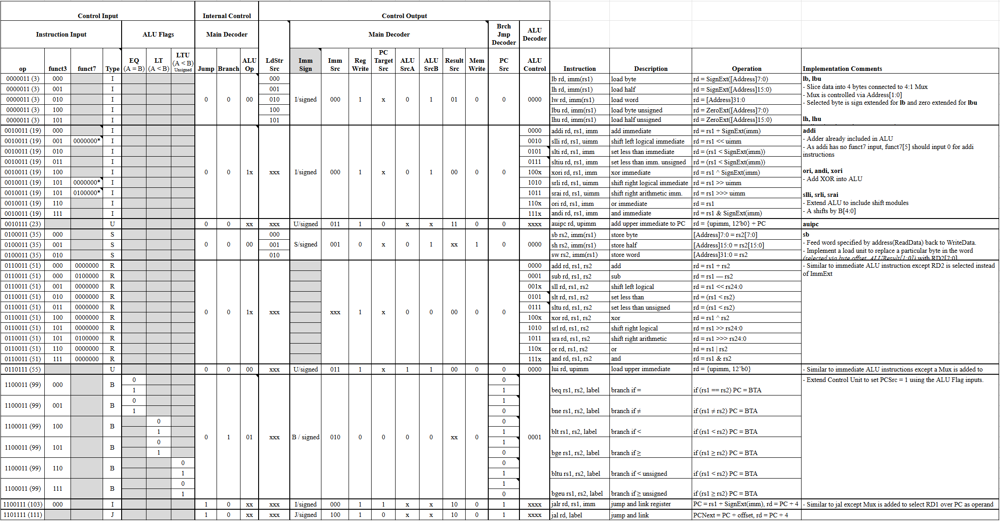

# Single-Cycle RISC-V RV32I CPU
For this project, I simulated a single-cycle CPU based on the [RISC-V RV32I ISA](https://riscv.org/wp-content/uploads/2017/05/riscv-spec-v2.2.pdf) written using SystemVerilog.
The CPU is designed with reference to the book "Digital Design and Computer Architecture".
It supports all unprivileged instructions excluding FENCE.

## CPU Architecture

The datapath is comprised of the 5 fundamental stages of processing which are Fetching, Decoding, Executing, Memory access, and Writeback.
As it is a single-cycle processor, all stages must be completed within the same clock cycle for each instruction.
Diagrams of other modules can be found in the [diagrams pdf](diagrams/rv32i_singlecycle.drawio.pdf).

### Controller Encoding

[In this spreadsheet](https://docs.google.com/spreadsheets/d/1ObX82jtqt7p4MyPdnp8WD8ZDNUcQtPOa4eVUBDf5Vuc/edit?usp=sharing), you can find the controller encodings which I used. 
These encodings are used to control the modules in the datapath based on the given instruction.

## Simulation and Testing

To test the core, I wrote a [RV32I assembly program](quartus\instruction_memory\rv32i_simple_test(desc).txt) which includes all unprivileged RV32I instructions. The instructions also include extreme values to test for edge cases. 
I then wrote a testbench which compares the Writeback value and the subsequent Program Counter value with their expected values for each test instruction.
The core is simulated using QuestaSim, which also allows me to execute the testbench and analyse the digital signals in the core for debugging and to further verify correctness.

## Tools used and Credits
- Intel Quartus Prime Lite Edition
- Questa Intel FPGA Starter Edition
- [Digital Design and Computer Architecture: RISC-V Edition by Harris & Harris](https://www.goodreads.com/book/show/57086525-digital-design-and-computer-architecture-risc-v-edition)

